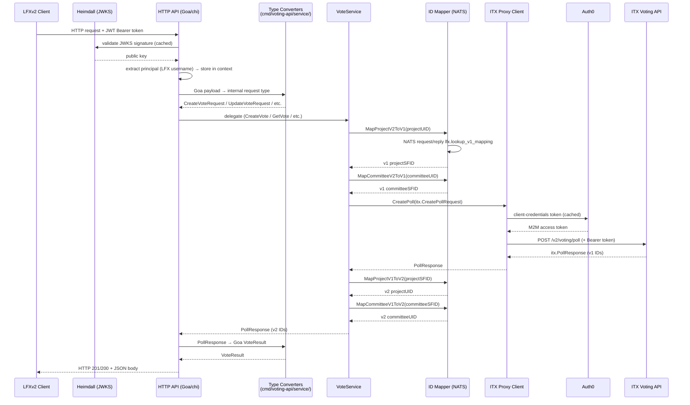
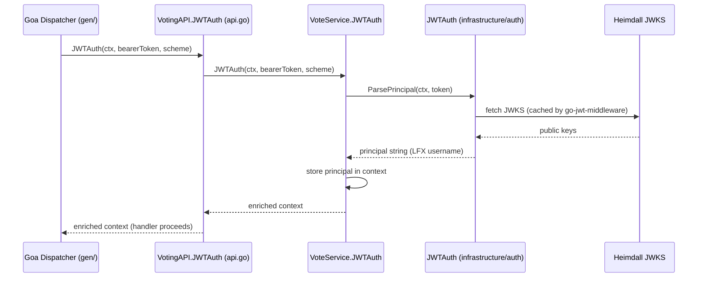
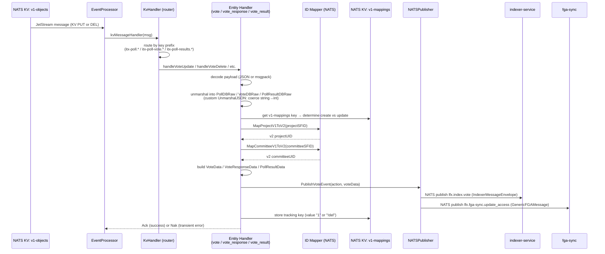
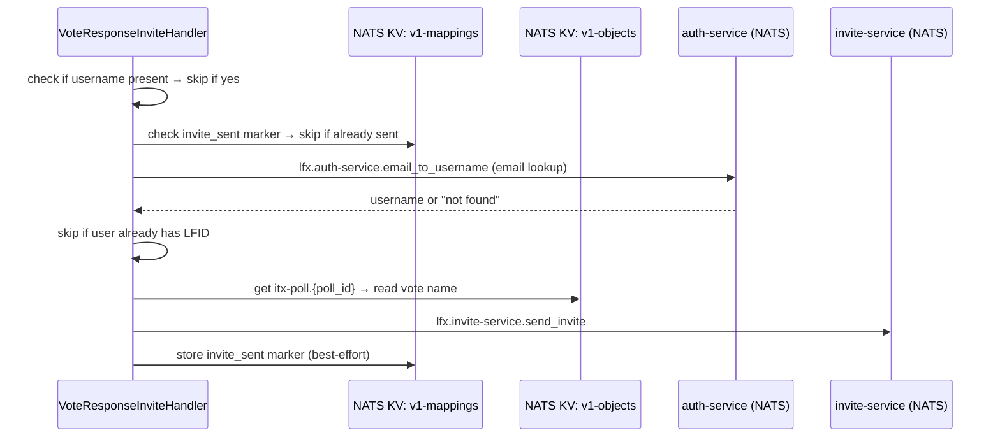
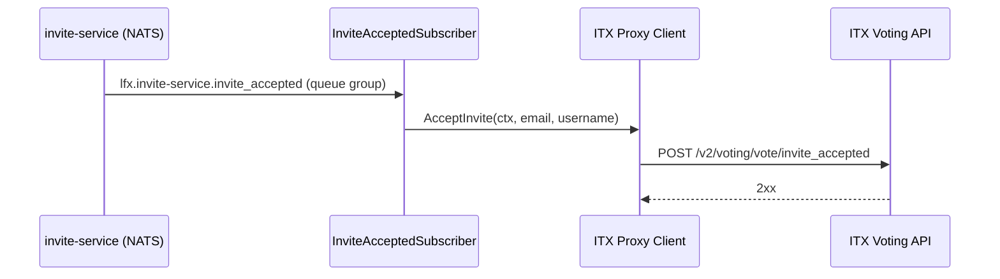
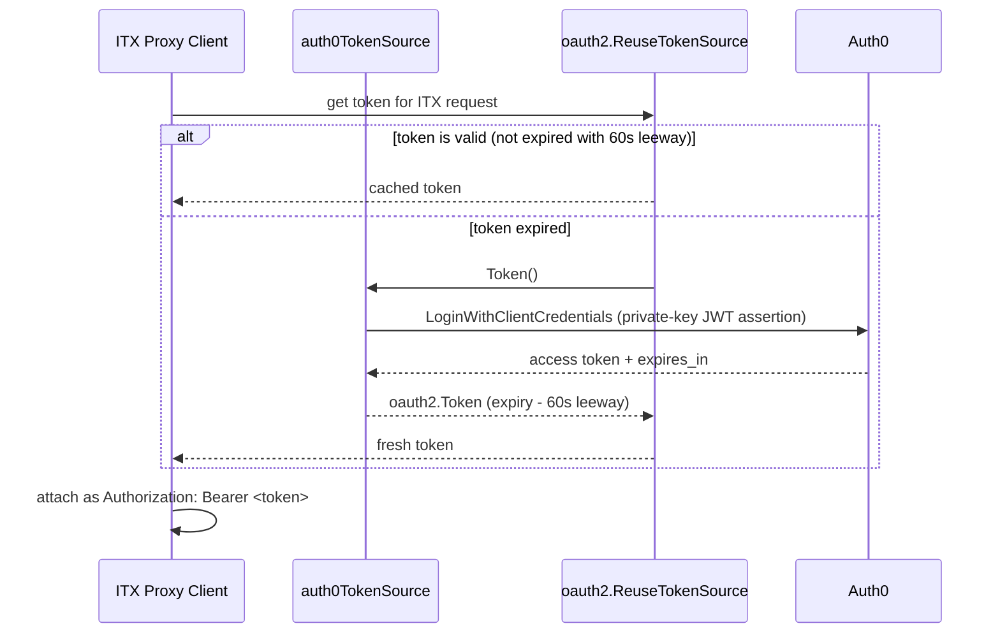

# Data Flow — LFX Voting Service

This document describes the major flows through the system. Only flows supported by the
implementation are documented here.

---

## Flow 1 — Synchronous HTTP API (Vote CRUD)

This flow covers all vote (poll) management operations: create, get, update, delete, extend,
enable, bulk-resend, and get-results.

**Evidence:** `internal/service/vote_service.go`, `internal/infrastructure/proxy/client.go`,
`cmd/voting-api/api_votes.go`, `cmd/voting-api/service/vote_converters.go`

---

## Flow 2 — Vote Response (Ballot Submission)

This covers `POST /vote_responses` and `PUT /vote_responses/{id}`. The flow is the same shape as
Flow 1 but goes through `VoteResponseService` and calls ITX's `/v2/voting/vote` endpoints.

ID mapping applies to `project_uid` only (no committee mapping for vote responses).

**Evidence:** `internal/service/vote_response_service.go`, `cmd/voting-api/api_vote_responses.go`

---

## Flow 3 — JWT Authentication

JWT validation is delegated to the `JWTAuth` method on the service, which is called by the
Goa-generated dispatcher before every protected endpoint.

**Local dev bypass:** When `JWT_AUTH_DISABLED_MOCK_LOCAL_PRINCIPAL` is set, `ParsePrincipal`
returns that env-var value without contacting Heimdall.

**Evidence:** `internal/infrastructure/auth/jwt.go`, `internal/service/vote_service.go:JWTAuth()`

---

## Flow 4 — NATS KV Event Processing (v1 → v2 Sync)

This is the asynchronous path. It runs entirely independently of the HTTP API path.

**Error classification:** `domain.ErrorTypeInternal` and `ErrorTypeUnavailable` → NAK (retry up
to 3×). Invalid data, missing fields, malformed JSON → ACK (skip permanently).

**Evidence:** `cmd/voting-api/eventing/kv_handler.go`, `vote_event_handler.go`,
`vote_response_event_handler.go`, `vote_result_event_handler.go`,
`internal/infrastructure/eventing/nats_publisher.go`, `docs/event-processing.md`

---

## Flow 5 — Invite Sending (optional, INVITES_ENABLED=true)

This flow runs inside the vote-response event handler after the response is published.

All invite steps are best-effort. Errors are logged but do not cause the parent KV message to be
NAK'd.

**Evidence:** `cmd/voting-api/eventing/vote_response_invite.go`,
`cmd/voting-api/eventing/invite_config.go`, `docs/lfid-invites.md`

---

## Flow 6 — Invite Acceptance Enrichment (optional, INVITES_ENABLED=true)

This runs on a separate NATS subscriber, independent of the KV event processor.

**Evidence:** `cmd/voting-api/eventing/invite_accepted_subscriber.go`,
`internal/infrastructure/proxy/client.go:AcceptInvite()`

---

## Flow 7 — ITX OAuth2 M2M Token Acquisition

The proxy client uses a cached, automatically-renewed token. This flow happens transparently on
the first ITX call and on every token expiry.

**Evidence:** `internal/infrastructure/proxy/client.go:NewClient()`, `auth0TokenSource.Token()`

---

## Documentation Gaps

- The exact retry and timeout behaviour of the NATS request/reply call inside `IDMapper` under
  prolonged NATS unavailability is not tested or documented.
- There is no documented flow for what happens when the ITX API returns a non-standard error body
  that doesn't contain `message` or `error` JSON fields.
- The `v1-mappings` KV bucket is written by this service but may also be written by other services.
  The full lifecycle of this bucket is not documented here.
