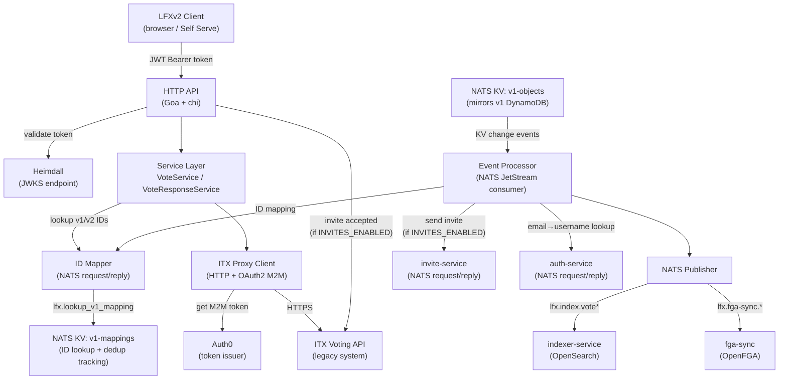

# Architecture Overview — LFX Voting Service

## Purpose

The LFX Voting Service is a **stateless HTTP proxy for the synchronous API path** — it sits between
LFXv2 clients and the ITX legacy voting system and owns no persistent poll or ballot data. The
asynchronous event path maintains create/update/delete deduplication markers and invite-sent state
in the NATS `v1-mappings` KV bucket. Its responsibilities are:

1. **Authentication translation** — validates Heimdall-issued JWTs from LFXv2 clients; obtains
   OAuth2 M2M tokens to authenticate outbound ITX calls.
2. **ID translation** — converts LFXv2 UUIDs to ITX/v1 Salesforce IDs (SFIDs) on the way in, and
   back on the way out, via a NATS request/reply lookup.
3. **Terminology translation** — LFXv2 calls the resource a *vote*; ITX calls it a *poll*. The
   service translates field names and API paths in both directions.
4. **Event processing** — consumes a NATS JetStream KV bucket that mirrors v1 DynamoDB data,
   transforms it into v2 format, and forwards it to the indexer service (OpenSearch) and fga-sync
   service (OpenFGA).
5. **Invite lifecycle** — optionally sends LFID invite emails to vote participants who lack an
   account, and enriches ITX records when an invite is accepted.

## Major Architectural Components

| Component | Location | Role |
|---|---|---|
| HTTP API (Goa) | `cmd/voting-api/api*.go`, `gen/` | Request entry, auth, error mapping |
| Goa DSL | `api/voting/v1/design/` | Source of truth for all API shapes |
| Vote service | `internal/service/vote_service.go` | Poll CRUD business logic + ID mapping |
| Vote response service | `internal/service/vote_response_service.go` | Ballot submission business logic |
| ITX proxy client | `internal/infrastructure/proxy/client.go` | All outbound ITX HTTP calls |
| ID mapper | `internal/infrastructure/idmapper/` | v1 SFID ↔ v2 UUID via NATS |
| Event processor | `cmd/voting-api/eventing/` | NATS KV consumer + per-entity handlers |
| NATS publisher | `internal/infrastructure/eventing/nats_publisher.go` | Publishes to indexer + fga-sync |
| JWT authenticator | `internal/infrastructure/auth/jwt.go` | Heimdall JWKS token validation |
| Domain interfaces | `internal/domain/` | Contracts between layers |

## High-Level Dependency Diagram

## Major External Systems

| System | Protocol | Purpose |
|---|---|---|
| **ITX Voting API** | HTTPS (OAuth2 M2M) | Authoritative store for all poll and vote-response data |
| **Heimdall** | HTTPS (JWKS) | JWT public key validation |
| **Auth0** | HTTPS | Issues M2M tokens for ITX authentication |
| **NATS JetStream** | TCP (NATS protocol) | KV event sync, ID mapping, invite/user lookups, event publishing |
| **indexer-service** | NATS pub/sub | Indexes vote + vote-response data into OpenSearch |
| **fga-sync** | NATS pub/sub | Writes/removes OpenFGA relationship tuples |
| **invite-service** | NATS request/reply | Sends LFID invite emails to vote participants |
| **auth-service** | NATS request/reply | Resolves LFX usernames from email addresses |

## Primary Communication Mechanisms

- **Inbound:** HTTP/1.1 REST (Goa-generated server, chi router), JWT in `Authorization` header
- **Outbound (ITX):** HTTPS REST with OAuth2 Bearer token (auto-renewed via `oauth2.ReuseTokenSource`)
- **Outbound (events):** NATS core pub/sub for fire-and-forget messages to indexer and fga-sync
- **Outbound (ID mapping):** NATS request/reply (`lfx.lookup_v1_mapping`) with 5-second timeout
- **Inbound (KV events):** NATS JetStream durable consumer on stream `KV_v1-objects`

## Important Architectural Boundaries

1. **Generated ↔ Hand-written code** — `gen/` is entirely generated by Goa; never edited manually.
2. **API layer ↔ Service layer** — The API layer converts Goa-generated types to internal request
   types (`cmd/voting-api/service/`), then delegates all logic to the service layer.
3. **Service layer ↔ Infrastructure** — The service layer depends only on `internal/domain`
   interfaces; it never imports `internal/infrastructure` directly.
4. **Synchronous HTTP path ↔ Asynchronous event path** — The HTTP API (votes/vote_responses) and
   the NATS KV consumer (event processor) are entirely independent execution paths sharing only the
   domain interfaces and the ID mapper.
5. **v2 IDs ↔ v1 IDs** — All v2-to-v1 translation happens in the service layer before the proxy
   call; all v1-to-v2 translation happens after the proxy response. The proxy client never sees v2
   UUIDs.

## Related Documentation

- [`components.md`](components.md) — detailed per-component descriptions
- [`data-flow.md`](data-flow.md) — request and event flow sequences
- [`dependencies.md`](dependencies.md) — external dependencies and integrations
- [`boundaries.md`](boundaries.md) — architectural boundaries and violations
- [`../event-processing.md`](../event-processing.md) — deep-dive on NATS KV event processing
- [`../itx-proxy-implementation.md`](../itx-proxy-implementation.md) — ITX proxy patterns
- [`../fga-contract.md`](../fga-contract.md) — FGA message contract
- [`../api-contracts.md`](../api-contracts.md) — LFXv2 ↔ ITX field mappings
- [`../glossary.md`](../glossary.md) — service-specific terminology
